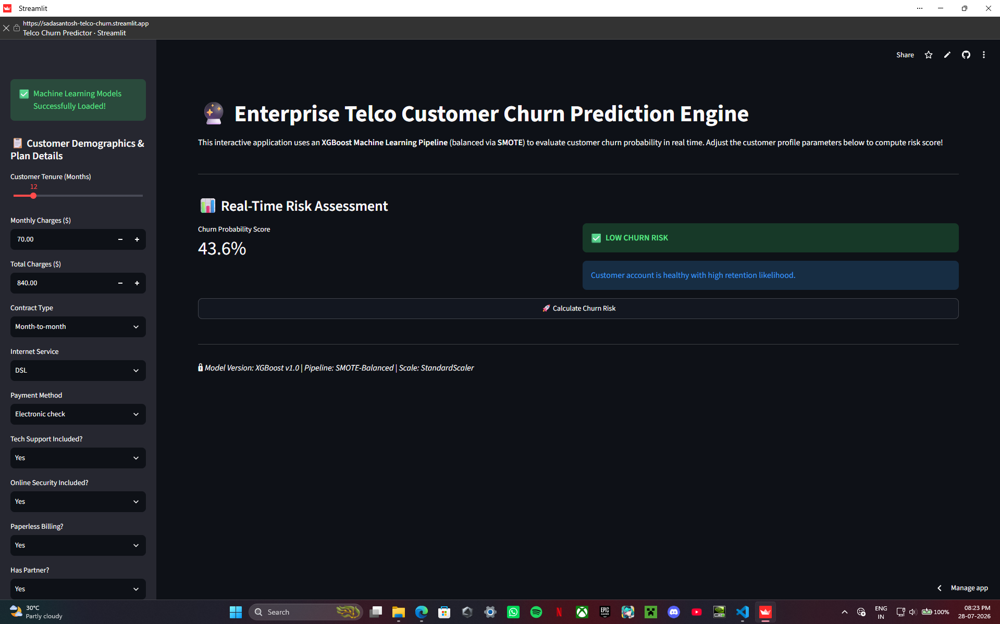

# 🚀 Applied Machine Learning & Data Science Projects

Welcome to my machine learning portfolio! This repository contains end-to-end data science projects ranging from core data analysis to production-deployed predictive web applications.

👉 **Featured Deployment:** [Live Telco Churn Prediction Engine](https://sadasantosh-telco-churn.streamlit.app)

---

## 📌 Portfolio Index & Overview

| Project | Domain | Key Technologies | Status / Link |
| :--- | :--- | :--- | :--- |
| **01. Student Performance Classifier** | Education Analytics | Python, Scikit-Learn, Decision Trees | Completed |
| **02. Corporate Employee Analytics** | HR & Workforce Analytics | Pandas, Seaborn, Attrition EDA | Completed |
| **03. Telco Customer Churn Engine** | Telecom Customer Retention | XGBoost, SMOTE, Streamlit Cloud | 🚀 [Live App](https://sadasantosh-telco-churn.streamlit.app) |

---

## 🎓 Project 01: Student Performance Classifier

### 📌 Problem Statement
Predicting student academic outcomes based on demographic, behavioral, and historical academic attributes to enable early intervention for at-risk students.

### 🛠️ Key Technical Highlights
* **Task:** Multi-Class / Binary Classification
* **Algorithms Applied:** Logistic Regression, Decision Trees, Random Forest
* **Evaluation Metrics:** Accuracy, Precision, Recall, and F1-Score evaluation across demographic features.

---

## 🏢 Project 02: Corporate Employee Analytics

### 📌 Problem Statement
An exploratory data analysis (EDA) and predictive modeling project analyzing workforce metrics, employee satisfaction scores, and primary drivers of corporate attrition.

### 🛠️ Key Technical Highlights
* **Task:** Exploratory Data Analysis & Feature Importance
* **Techniques:** Feature Correlation Heatmaps, Demographic Profiling, Attrition Rate Isolation
* **Data Processing:** Categorical encoding, outlier handling, and statistical hypothesis testing.

---

## 🔮 Project 03: Enterprise Telco Customer Churn Prediction Engine

### 📌 Problem Statement
Customer churn poses a significant revenue threat in telecommunications. This project delivers an interactive decision-support engine that enables retention teams to evaluate customer churn risk in real time.



### 🛠️ Key Technical Highlights
* **Imbalance Handling:** Applied **SMOTE (Synthetic Minority Over-sampling Technique)** to train balanced models on imbalanced churn data.
* **Model Pipeline:** Trained an **XGBoost Classifier** optimized for high-recall customer risk detection.
* **Deployment:** Deployed an interactive frontend using **Streamlit** on **Streamlit Community Cloud**.
* **Live App Link:** [https://sadasantosh-telco-churn.streamlit.app](https://sadasantosh-telco-churn.streamlit.app)

---

## ⚙️ Global Local Setup & Running Instructions

To clone and run any of these projects locally on your computer:

1. **Clone the Repository:**
   ```bash
   git clone [https://github.com/SadaSantosh/Python_Prep.git](https://github.com/SadaSantosh/Python_Prep.git)
   cd Python_Prep